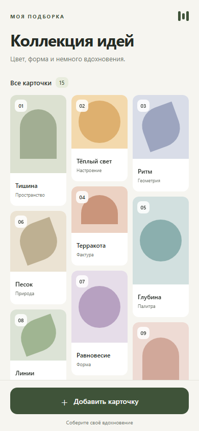

# Masonry Grid — React Native

Тестовое задание: переиспользуемая сетка Masonry / Waterfall и экран «Коллекция идей». Реализовано на **Expo SDK 57, React Native 0.86, React 19 и TypeScript**. Готовые библиотеки Masonry не используются.

## Запуск

Нужны Node.js **22.13 или новее** и npm. Зависимости зафиксированы в `package-lock.json`.

```sh
npm ci
npm start
```

Откройте проект через Expo Go, совместимый с SDK 57: отсканируйте QR-код в терминале. Компьютер и телефон должны находиться в одной сети. Для iOS можно использовать камеру, для Android — сканер в Expo Go.

Другие варианты:

```sh
npm run android  # установленный Android-эмулятор или подключённое устройство
npm run ios      # iOS Simulator, только macOS с Xcode
npm run web      # браузерная демонстрация через React Native Web
```

Учётная запись Expo, backend, API-ключи и удалённые изображения для этой демонстрации не нужны. Если локальная сеть блокирует подключение телефона, можно запустить `npx expo start --tunnel` (потребуется интернет и установка предложенной Expo утилиты туннеля).

## Что реализовано

- Три колонки. На экране шириной 390 логических пикселей: боковые поля 20, промежутки 10, ширина карточки **110**.
- 15 начальных карточек с разной высотой. Каждое нажатие «Добавить карточку» создаёт новую карточку со случайным соотношением сторон обложки.
- Новая карточка располагается в самой низкой колонке; при равенстве выбирается первая слева.
- Позиции уже существующих карточек и текущая прокрутка сохраняются при добавлении.
- Вертикальный `ScrollView`; кнопка добавления остаётся доступной в нижней части экрана.
- Safe area для вырезов и системных панелей. Ширина экрана ограничена 390; на более узких устройствах все три колонки пропорционально сужаются.
- Карточки и кнопка имеют accessibility labels. В web кнопка доступна с клавиатуры, добавление подтверждается статусом.

Предпросмотр web-версии при 390 × 844:



## Архитектура

```text
App.tsx                                  SafeAreaProvider и точка входа
src/
  components/
    masonry/
      masonry-layout.ts                  чистый расчёт геометрии
      masonry-layout.test.ts             тесты алгоритма
      masonry-grid.tsx                   generic-компонент раскладки
      index.ts                           публичный API
    collection-card.tsx                  представление карточки
  data/cards.ts                          модель и генератор демонстрационных данных
  screens/collection-screen.tsx          список, добавление и прокрутка
  theme.ts                               цвета и отступы
e2e/collection.spec.ts                    браузерные поведенческие проверки
```

`calculateMasonryLayout` последовательно обходит данные. Для каждого элемента находит колонку с минимальной накопленной высотой, вычисляет координаты и обновляет высоту этой колонки. Промежуток добавляется только **между** карточками: над первой и под последней карточкой лишнего отступа нет.

```text
columnWidth = (gridWidth - gap × (columnCount - 1)) / columnCount
cardHeight  = columnWidth / aspectRatio + captionHeight
```

Например, для высот `[300, 100, 200, 50, 30]` и промежутка 10 индексы колонок будут `[0, 1, 2, 1, 1]`, итоговые высоты — `[300, 200, 200]`. Это балансировка по высоте, а не распределение по кругу.

Время расчёта: **O(n × k)**, где `n` — число карточек, `k` — число колонок; при трёх колонках — **O(n)**. Память: **O(n + k)** для позиций и высот колонок.

Раскладка вычисляется из данных при рендере. Массивы колонок и координаты не дублируются в состоянии, эффекты для пересчёта не нужны. При добавлении исходные объекты сохраняют ссылки; новая геометрия совпадает с прежней для всех старых карточек. При изменении ширины или высот данные пересчитываются полностью.

`MasonryGrid<T>` не знает о содержимом карточек и не владеет прокруткой. Он принимает `data`, `width`, `columnCount`, `gap`, `getItemHeight`, `keyExtractor` и `renderItem`. Пример использования находится в `collection-screen.tsx`.

Контракт компонента:

- `width` — внутренняя ширина сетки, уже без внешних полей.
- `getItemHeight(item, columnWidth)` — чистая функция, возвращающая **полную положительную высоту** карточки, включая её содержимое и внутренние отступы, но без промежутка сетки.
- `renderItem(item)` — содержимое, заполняющее выделенную ячейку; корневой элемент демонстрационной карточки использует `flex: 1`.
- `keyExtractor` — уникальный стабильный ключ. Данные следует обновлять иммутабельно.
- Количество колонок должно быть целым и положительным; некорректная геометрия отклоняется через `RangeError`.

Карточки находятся в одном контейнере и позиционируются абсолютно. Высота контейнера равна высоте самой высокой колонки, поэтому `ScrollView` прокручивает весь контент. Порядок дочерних элементов совпадает с порядком данных; переход карточки между колонками при изменении размеров не меняет её ключ.

Включён [React Compiler](https://docs.expo.dev/guides/react-compiler/). Содержимое ячейки выделено в отдельный компонент со стабильной ссылкой на карточку и числовыми пропсами геометрии. Это позволяет компилятору переиспользовать результат рендера неизменившихся ячеек; ручные `memo`, `useMemo` и `useCallback` не добавлены. Полный проход алгоритма при добавлении остаётся линейным.

## Проверки

```sh
npm run check          # TypeScript, ESLint, Vitest и Prettier
npm run build:web      # production web-бандл в dist/
npx expo export --platform all  # JS/Hermes-бандлы web, Android и iOS; не APK/IPA
npx expo install --check
npx expo-doctor
```

Браузерные тесты:

```sh
npx playwright install chromium --only-shell
npm run test:e2e
```

Playwright сам запускает Expo на порту 8081 и завершает запущенный им сервер после тестов. Если порт уже занят другим приложением, освободите его перед запуском. Тесты не требуют учётной записи Expo.

Покрытие: 26 тестов алгоритма (включая 1000 карточек, пустые данные, ничьи, изменение ширины и неверные параметры) и 5 браузерных сценариев: геометрия на 390 px, выбор самой низкой колонки при каждом добавлении, серия из 60 добавлений и прокрутка, ширины 320/360/768, активация кнопки клавишей Enter.

При подготовке решения `npm run check` и все E2E прошли; бандлы всех трёх платформ успешно экспортированы, `expo-doctor` завершил 21 из 21 проверок без замечаний.

## Ограничения и упрощения

- Высота известна до рендера: соотношение сторон обложки плюс фиксированная подпись. Произвольный многострочный текст и изображения неизвестного размера потребуют измерения через `onLayout` или передачи достоверных размеров в данные. Подписи в демонстрации однострочные, при нехватке места сокращаются; масштаб шрифта внутри карточки ограничен 1.4, полное название остаётся в accessibility label.
- Используется жадный алгоритм, сохраняющий порядок обработки. Он выбирает лучшую колонку для очередной карточки, но не ищет глобально оптимальное разбиение всего списка и не перемешивает старые карточки ради абсолютно одинаковой высоты колонок.
- `ScrollView` монтирует все карточки. Для тестового и небольших подборок это простой вариант; тысячи элементов потребуют виртуализации по вычисленным координатам. Тест на 1000 элементов проверяет алгоритм, а не скорость отрисовки такого количества карточек на телефоне.
- Добавленные карточки хранятся в памяти и исчезают после перезапуска. Демо поддерживает только добавление, поэтому ID — монотонный номер.
- Скриншот и E2E относятся к React Native Web в Chromium. Запуск на физических iOS/Android-устройствах и нативный скринридер не проверялись. Web-тесты не заменяют такую проверку.

Выбор окружения основан на [документации Expo SDK 57](https://docs.expo.dev/versions/v57.0.0/) и официальной [инструкции запуска web](https://docs.expo.dev/workflow/web/).
